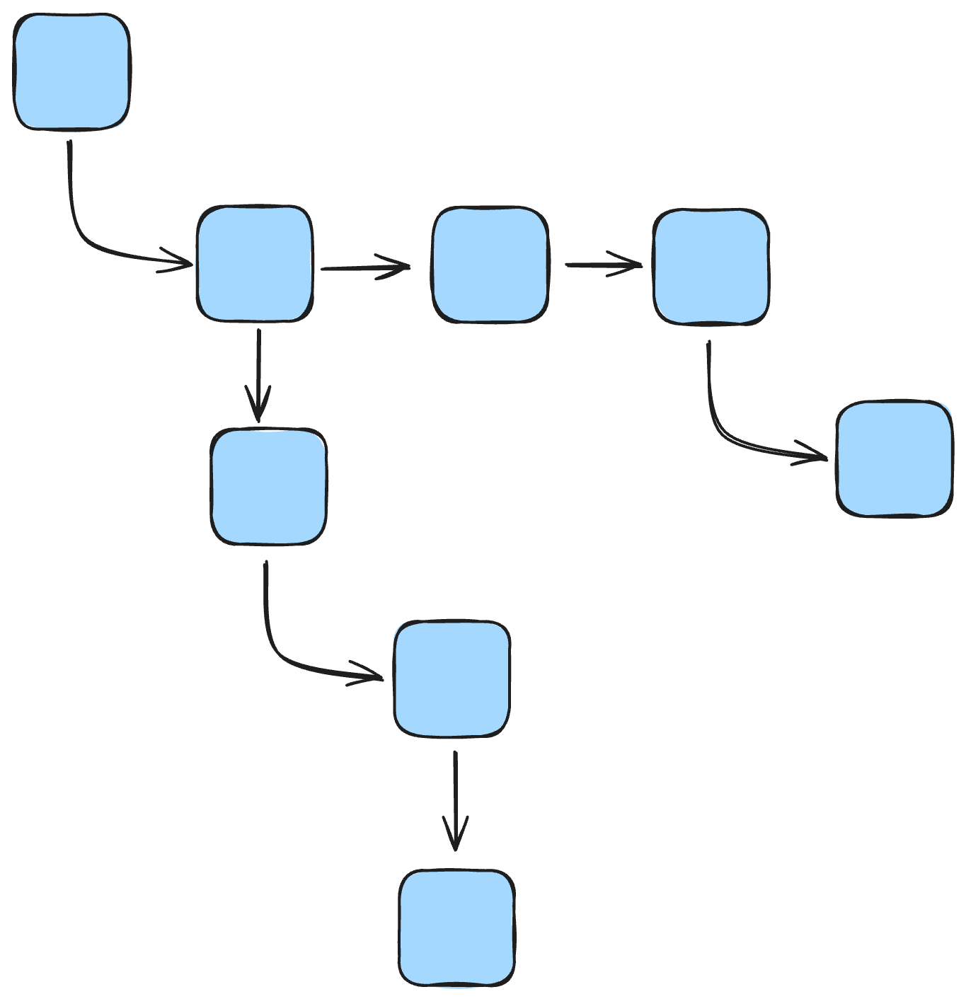
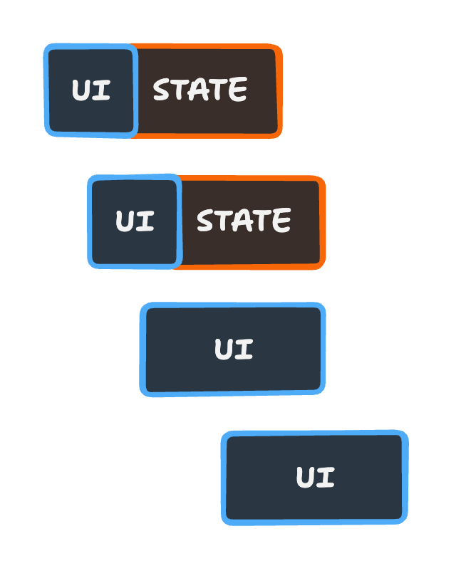

# Mental Model

React components represents the UI of the application. It is a tree of elements and styling, encapsulated by a component and composed into a tree.

{width=250px}

When you start introducing state in React, that state is defined with the elements and the styling. Some components defines state and others only consume parent props.

{width=250px}

As your application grows your state will start diverge from the UI. That means slowly a tree of state will emerge from the components and a separate tree of UI.
