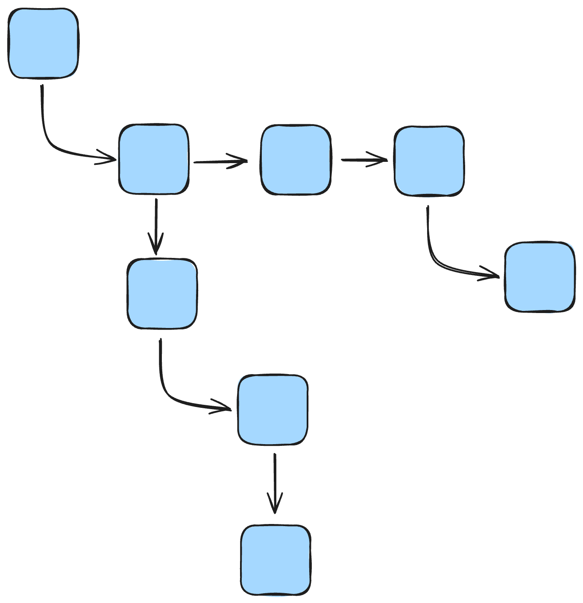
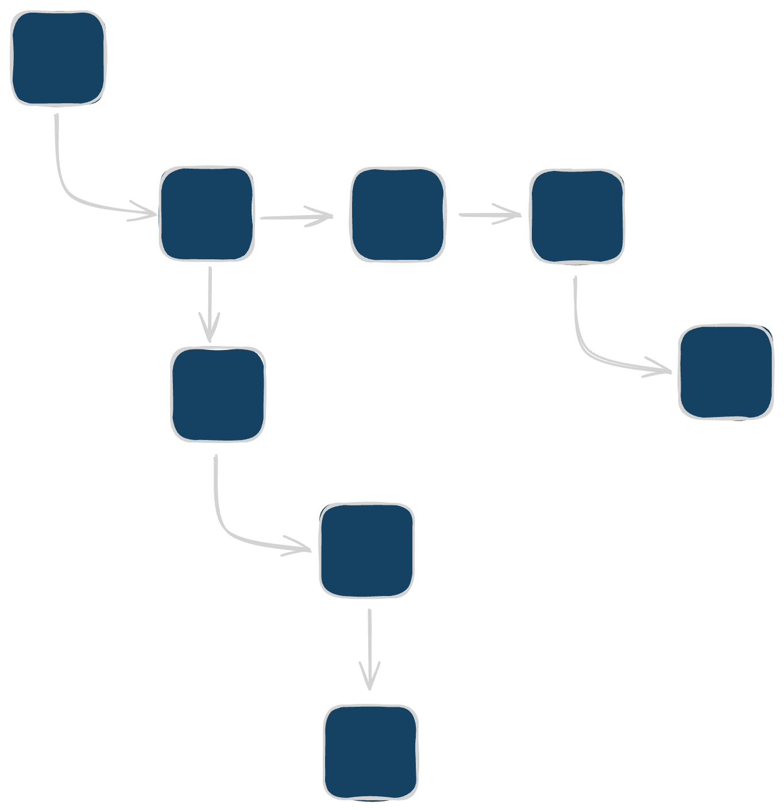
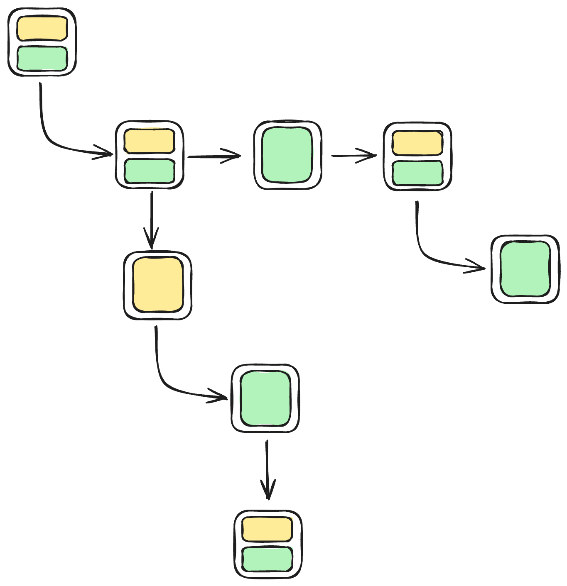
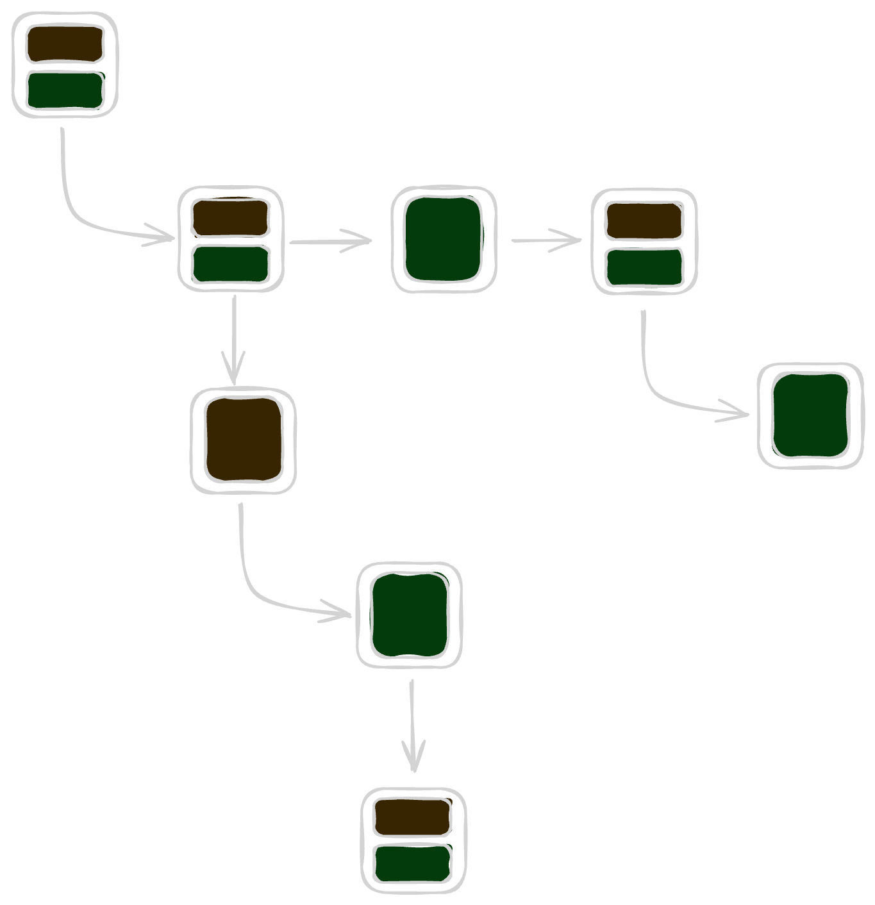
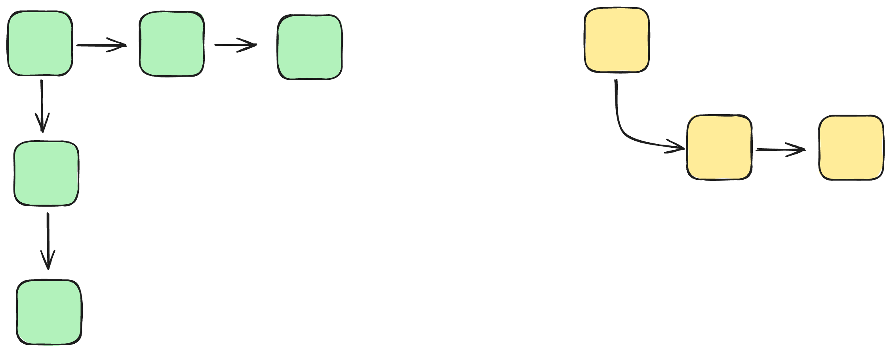
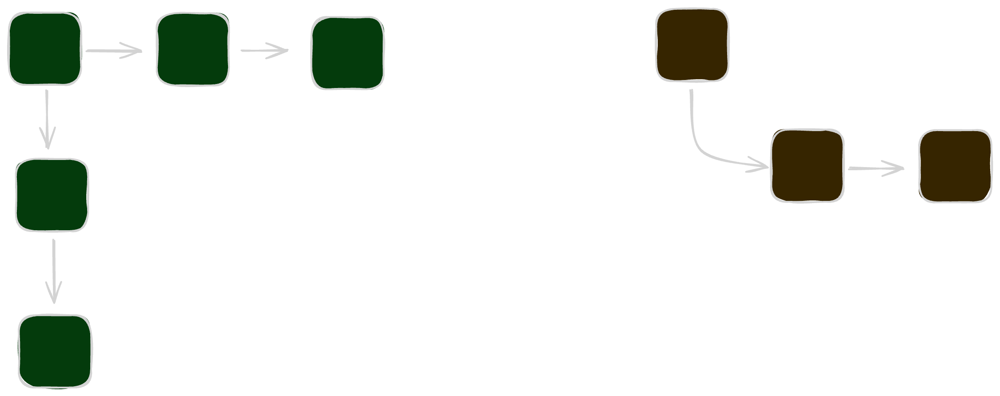

# Mental Model

Components are the fundamental building blocks of a React application. They form a tree that represents your UI.

{width=250px .light-only}
{width=250px .dark-only}

Each component renders elements, applies styles, and can hold local state for interactive behaviour.

{width=250px .light-only}
{width=250px .dark-only}

As applications grow, state needs to be shared across many components. Keeping that state inside components means passing it down through props, lifting it to a common ancestor, or using Context — all of which add indirection and boilerplate.

The better approach is to move application state outside the component tree entirely:

{width=250px .light-only}
{width=250px .dark-only}

ReactX is how you do that with plain classes. Your state lives in a module-level singleton, components import it directly, and React re-renders only the components that actually read the values that changed.

```
State class  →  reactive()  →  export const app
                                      ↓
                              components import app
                              and read what they need
                                      ↓
                              React re-renders only
                              the affected components
```

Each tool does what it is best at: ReactX manages state and data complexity, React renders the UI.
